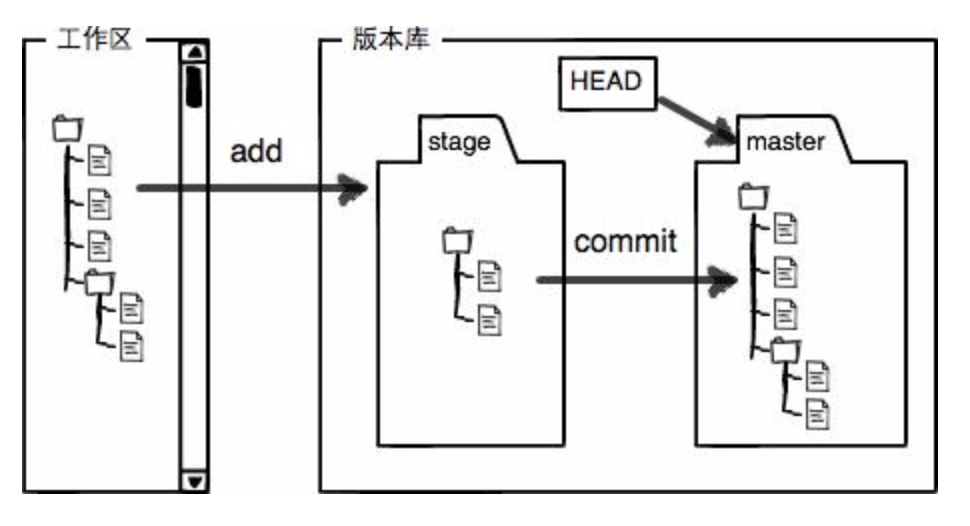

- 创建的learngit包括两部分，工作区和版本库.

  - 打开learngit后能看到的目录就是工作区，即learngit中的可见部分即为一个工作区
  - 而隐藏的.git目录就是版本库，其中包括暂存区**stage**，git自动创建的第一个分支**master**以及指向master的指针**HEAD**
  - 把文件加入.git时分两步
    - 第一步用git add，就是把文件加入到暂存区
    - 第二部git commit提交更改，就是把暂存区的内容提交到当前分支

- Git比其他版本控制系统设计得优秀，因为Git跟踪并管理的是修改，而非文件

  commit只负责把暂存区的修改提交，不会提交工作区的修改，即修改完之后如果不用git add加入到暂存区，那么是不会commit到master的

