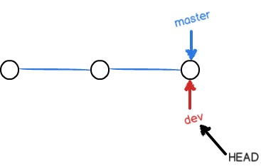
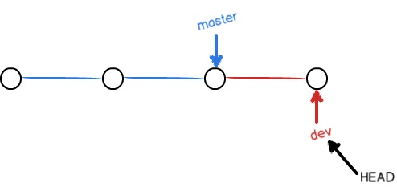
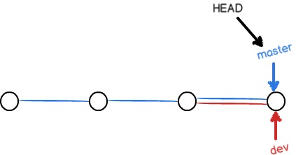

创建与合并分支

- 前面我们已经知道**<u>HEAD指向当前最新的分支的最新版本</u>**，一开始的时候是这样，HEAD指向主分支master

  

  每次提交新的版本，master随之更新。

- 创建新的分支

  > $ git branch dev

  切换到new分支

  > $ git checkout dev

  也可以一步代替上面的两步，创建并切换

  > $ git checkout -b dev

  

- 可以用**<u>git branch</u>**查看所有分支，当前分支的前面会有个*号。现在切换到dev分支上进行修改

  

  然后我们切换到master分支，即将HEAD指向master

  >  $ git checkout master

- 现在合并分支

  >  $ git merge dev

  这个命令可以把制定分支合并到当前分支上，在这里就是把dev分支合并到当前分支master上

  

- 然后删除dev分支

  > $ git branch -d dev

  之后git branch查看分支就只剩下master分支了

- ### 小结

  Git鼓励大量使用分支：

  查看分支：`git branch`

  创建分支：`git branch <name>`

  切换分支：`git checkout <name>`

  创建+切换分支：`git checkout -b <name>`

  合并某分支到当前分支：`git merge <name>`

  删除分支：`git branch -d <name>`